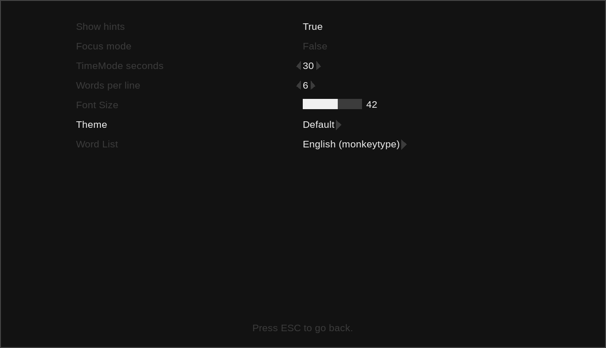

<h1 align="center">taip</h1>

A typing practice program written in C using SDL2. Visually inspired by projects like [monkeytype](https://github.com/monkeytypegame/monkeytype). It aims to be minimal on resources and unlike most modern typing programs, be a desktop first application - usable without access to the internet.




### Building and running

**Supported Platforms:** Linux

note: SDL2 itself is cross-platform. If you are on a different platform, porting it is probably very possible!

**Dependencies**

- cmake
- sdl2
- sdl2\_ttf
- sdl2\_gfx

To build the project, use the following commands.

```bash
mkdir build && cd build && cmake .. && make
```

To run the project, execute the 'taip' binary file

```bash
./taip
```

Optionally, there is an example config file included.

On Linux, taip wil look for it in ```/home/USER/.config/taip/taip.conf```

### Disclaimer

This project is far from complete and currently in a "minimum viable product" state.

Expect big changes and more features as the development progresses.

The master/main branch is not guaranteed to be bug free or even stable at this time.

### Contributing

All contributions are welcome. Using Github and submitting a pull request for smaller changes or creating an issue for larger ones is the prefered method.

### Licensing

This project is free software licensed under the MIT license. For the full text of the MIT license, read the 'LICENSE' file included with this project.

Liberation-Sans font included in the /fonts directory is licensed under the [OFL v1.1](https://github.com/liberationfonts/liberation-fonts/blob/main/LICENSE) license.

The default English wordlists (250, 1k) use word frequencies from <a href="https://github.com/IlyaSemenov/wikipedia-word-frequency">this repo</a> and are <a href="https://github.com/IlyaSemenov/wikipedia-word-frequency/blob/master/LICENSE">licensed under MIT</a>.
